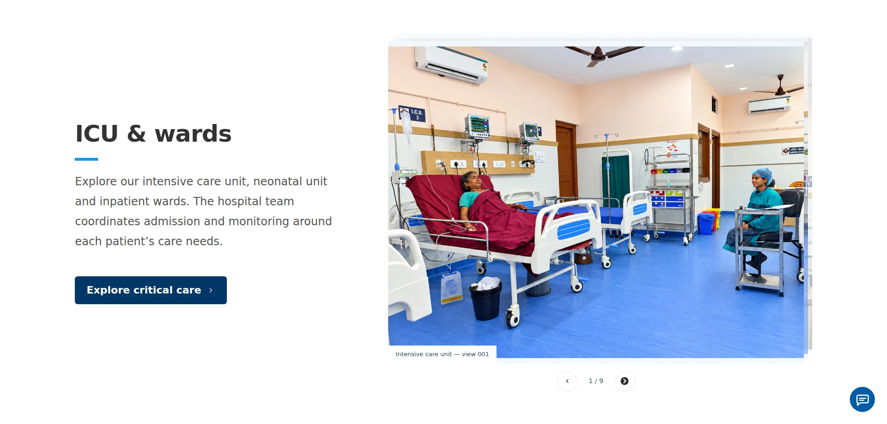
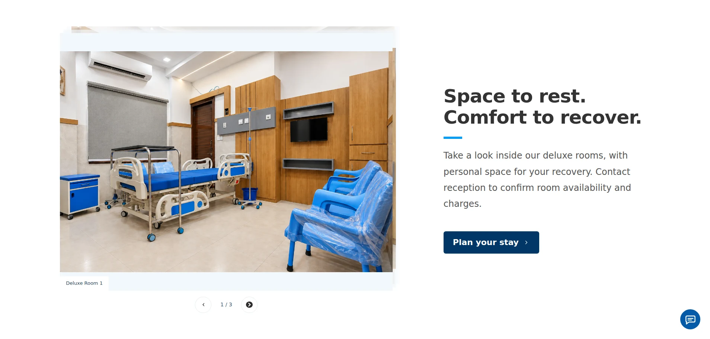
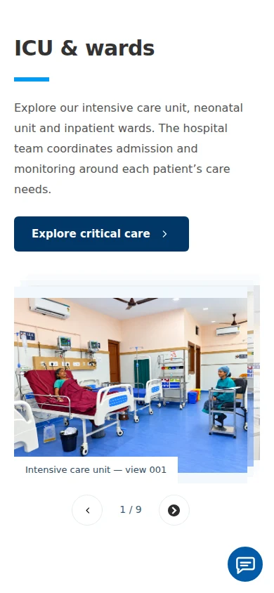

# Gallery and breadcrumb design QA — 3 October 2026

Reference: the two desktop screenshots supplied with the request, each 1908 × 913 pixels. Implementation: the existing hospital website, using the supplied hospital photographs, icons and existing brand fonts/colours.

Final result: passed.

- Desktop sections measure 1908 × 913 at the reference viewport and 1366 × 768 on a laptop. Alternating text-first/image-first compositions use an 83.1% content width, a 35% text column, a 57.5% image column and a 7.5% gap. Source photographs retain their aspect ratio; carousel layers, captions and controls are intentional additions.
- Compared typography, spacing, brand colours, image quality and hospital-specific content to both supplied layouts. Existing brand typography and CTA colours are retained. No unresolved P0/P1/P2 findings.
- Checked 390 × 844 mobile viewport: stacked layout, fully loaded photographs, visible controls and no horizontal overflow. Opened and decoded every one of the 24 supplied photographs in desktop carousels.
- Previous/next, wraparound, keyboard arrows, full-image dialog and Escape pass in all four collections. No browser JavaScript errors.
- Browser checks confirm breadcrumbs follow the hero on home, about, appointment, doctors and profiles, services and detail pages, health library and articles, policies, site information, feedback, sitemap, search and awards. Automated sitemap checks cover every public route.
- Lint, verified Cloudflare build and all 14 rendered HTML/integration tests pass. Standalone `tsc --noEmit` reports existing appointment-form and Cloudflare ambient-type configuration errors in untouched files; the repository's configured CI checks pass.

